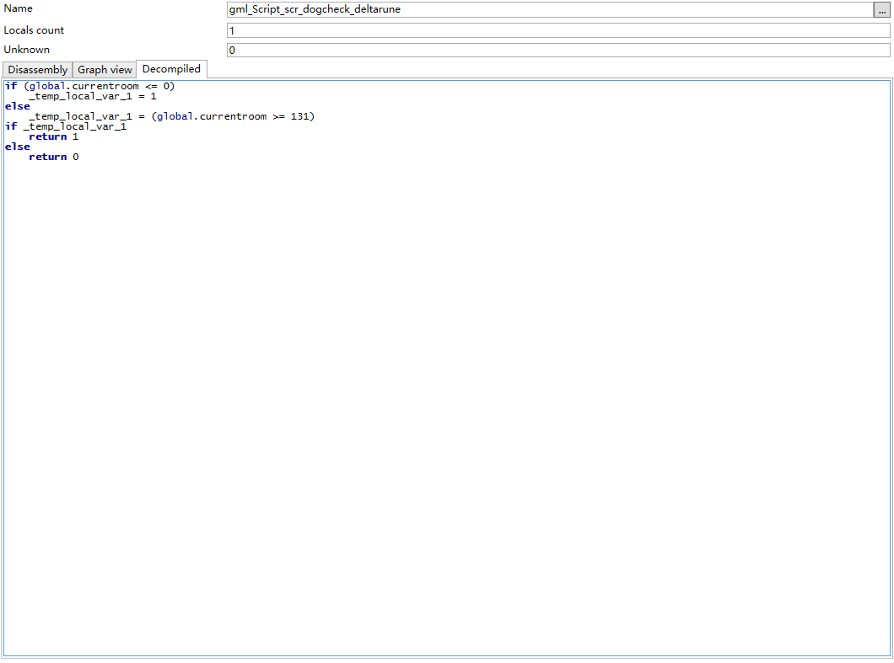

# Dogcheck

Today I have a idea to improve Dogcheck to a little one-line thing.

So I wrote this in GMS2, and it's working fine.

No more words.

# Output

## Deltarune room 0, in debug console:

```
?!!
dogchecked!
```

## Undertale: 

```
dogchecked!
```

# UndertaleModTool 0.1.24 decompile result

## scr_dogcheck_undertale

![[redacted]](UTMT_scr_dc_ut.png)

## scr_dogcheck_deltarune


